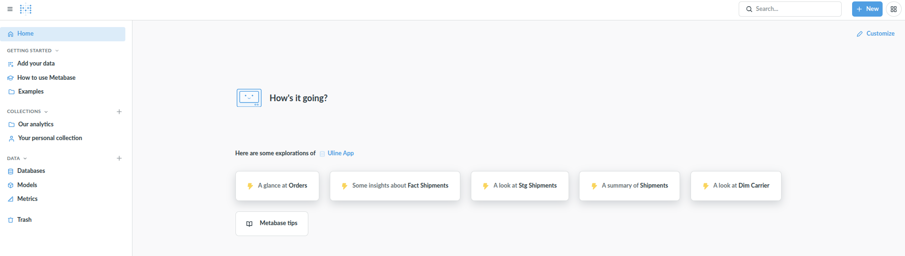
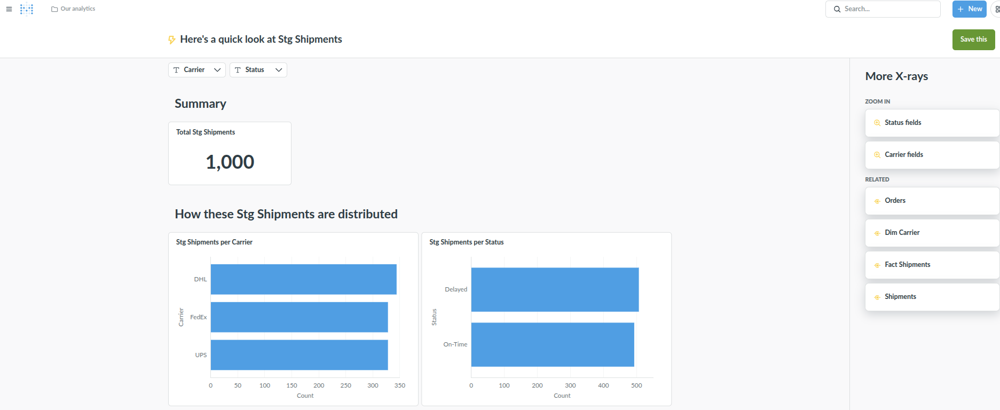

# 🚚 Logistics Analytics Pipeline (Python + SQL + Metabase)

An end-to-end data engineering and business intelligence project simulating a real-world logistics operation similar to large-scale distribution environments (e.g., warehouse-to-customer shipment systems).

This project demonstrates a complete analytics workflow:

- Synthetic data generation using Python
- Relational data modeling using SQL
- ETL pipeline development
- Star schema design (fact + dimension tables)
- Interactive BI dashboards using Metabase
- Analytics workflows transforming raw operational data into business intelligence and decision-support insights

The platform is designed to demonstrate how modern organizations convert:

```text
Raw Data → Structured Information → Operational Insights → Analytics-Driven Decision Support
```

The system is fully reproducible and runs locally using SQLite and Docker-based Metabase.
---

## 🧠 Business Problem Modeled

A logistics organization needs to answer questions such as:

- Are shipments being delivered on time?
- Which carriers are most reliable?
- What are transportation costs per shipment?
- Which warehouses are performing efficiently?
- How long does it take for orders to be fulfilled?

This project builds a simplified analytics system to support those questions.

---

## 🏗 Architecture

The pipeline follows a modern layered data architecture:
```
Python (Data Generation)
↓
Raw Data (CSV / SQLite)
↓
SQL Staging Layer (cleaning & joins)
↓
SQL Data Marts (fact & dimension tables)
↓
Analytics Tables (KPIs & aggregates)
↓
Power BI Dashboard
```

### Data Layers

- **Raw Layer** → simulated operational data (orders, shipments)
- **Staging Layer** → cleaned and standardized datasets
- **Mart Layer** → star schema (fact + dimension tables)
- **Analytics Layer** → KPI-focused queries for reporting

---

## 🧱 Data Model

The system is built around a simple **star schema**:

### Fact Table
- `fact_shipments`
  - order_id
  - shipment_id
  - ship_date
  - delivery_date
  - delivery_days
  - status

### Dimension Tables
- `dim_carrier` → UPS, FedEx, DHL
- `dim_warehouse` → warehouse locations
- `dim_date` → optional date breakdown

---

## ⚙️ Tech Stack

- Python (data generation & orchestration)
- SQL (data transformation & modeling)
- SQLite (local relational database)
- Pandas / NumPy (simulation & processing)
- Power BI Desktop (dashboarding)

---

## 🚀 How to Run the Project

### 1. Clone the repository

```bash
git clone https://github.com/NoSpectators/uline-logistics-analytics.git
cd uline-logistics-analytics
```

### 2. Install Dependencies
```bash
pip install -r requirements.txt
```

### 3. Run the Full Pipeline
This script builds the database
```bash
python src/pipeline/run_pipeline.py
```
This will:

- Generate synthetic orders and shipments
- Load data into a local SQLite database (logistics.db)
- Execute SQL transformations
- Build analytics-ready tables

### 4. Start Metabase (BI Layer)
Run Metabase using Docker:

```bash
docker run -d \
  -p 3000:3000 \
  --name metabase \
  -v metabase-data:/metabase-data \
  -v $(pwd):/data \
  metabase/metabase
  ```

Then open
```bash
http://localhost:3000
```

### 5. First-Time Metabase Setup
Inside Metabase:
1. Create admin user
2. Choose Add Database
3. Select SQLite
4. Enter database path: /data/metabase.db

### 6. Explore the Data
Explore the data using Metabase's interactive dashboards.

Connect to:
- fact_shipments
- dim_carrier
- dim_warehouse

### 7. Build you own dashboards!


## 📈 Dashboard Features

The Metabase dashboard includes:

🚚 Operational Metrics
- On-time delivery rate
- Average delivery duration
- Shipment volume by carrier
💰 Cost Insights
- Estimated transport cost trends
- Cost per mile / shipment
🏭 Warehouse Performance
- Shipment throughput per warehouse
- Delivery efficiency comparisons

## 📊 Dashboard Preview

The following dashboards were built in Metabase to visualize logistics performance and operational KPIs.

### Operational Overview



### Carrier & Delivery Performance




## 🧪 Data Simulation

Since this project does not use real company data, Python is used to simulate realistic logistics activity:

- Randomized order generation
- Carrier assignment (UPS / FedEx / DHL)
- Delivery delays based on probability
- Warehouse distribution logic

This ensures the pipeline behaves like a real production system while remaining fully self-contained and reproducible.

## 🧠 Key Engineering Concepts Demonstrated

This project demonstrates:

- Data pipeline design (end-to-end)
- ETL architecture (extract → transform → load)
- Star schema modeling
- SQL-based transformation logic
- BI-ready data modeling
- Reproducible analytics workflows 
- Separation of raw, staging, and mart layers

🎯 Why This Project

This project was designed to reflect the type of work performed in a data engineering / BI analytics role, including:

Building scalable data models
Supporting business decision-making
Creating reusable transformation logic
Integrating Python + SQL + BI tools

It is intended to demonstrate readiness for roles involving:

Data Engineering
Business Intelligence
Analytics Engineering

---

## 📊 Analytics Maturity Model

This project demonstrates how raw operational logistics data can evolve into increasingly valuable analytical insights through three layers of analytics:

### 1️⃣ Descriptive Analytics — “What happened?”

The current BI layer focuses on operational reporting and KPI visibility using SQL transformations and Metabase dashboards.

Examples include:
- On-time delivery rate
- Average shipment duration
- Shipment volume by carrier
- Warehouse throughput analysis
- Delivery delay trends

This layer provides historical and operational insight into logistics performance.

---

### 2️⃣ Predictive Analytics — “What is likely to happen?”

Planned enhancements include predictive modeling to identify potential operational risks before they occur.

Future predictive capabilities may include:
- Predicting delayed shipments
- Forecasting delivery duration
- Estimating shipment volume trends
- Identifying high-risk carriers or warehouses

This layer will introduce machine learning workflows using Python and scikit-learn.

---

### 3️⃣ Prescriptive Analytics — “What should we do?”

The final stage of the platform is intended to support operational decision-making through recommendation logic.

Examples may include:
- Recommending optimal carriers based on predicted delay risk
- Identifying warehouse routing improvements
- Suggesting operational adjustments to improve delivery performance

This layer transforms analytical insights into actionable business recommendations.

---

### 🎯 Analytics Vision

The long-term goal of this project is to demonstrate how modern data platforms transform:

```text
Raw Data → Operational Insights → Predictive Intelligence → Decision Support

📌 Future Improvements
Add Airflow-style orchestration
Introduce incremental data loads
Add slowly changing dimensions (SCD Type 2)
Deploy Power BI service integration
Containerize pipeline using Docker